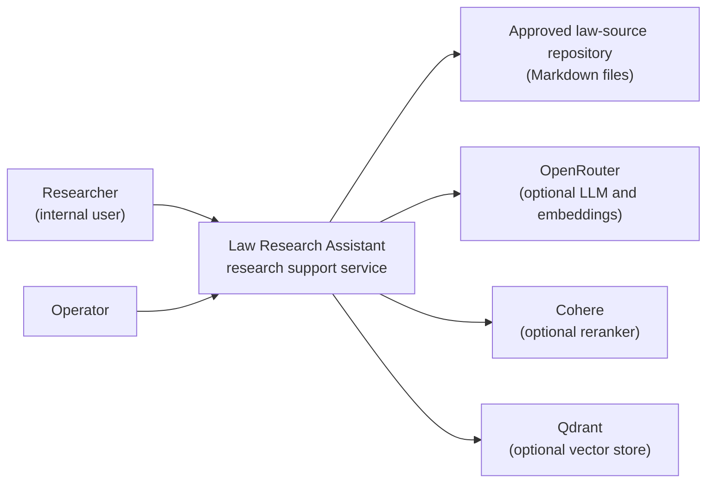
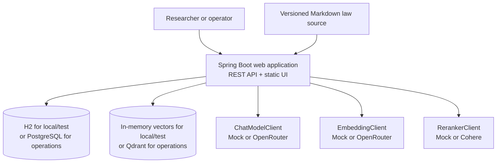
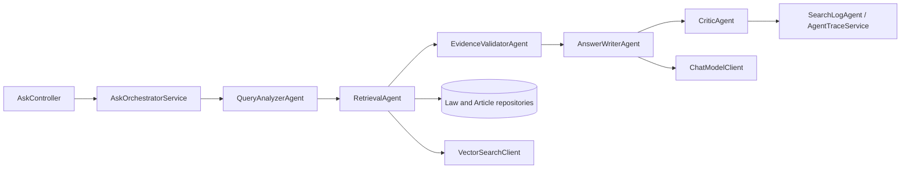

# C4 Architecture Overview

This document is a compact C4 view of the system. It describes the current implementation, not a target-state design.

## Level 1 — System Context



The system supports legal research in a deliberately limited law domain. It supplies cited source material and research-oriented explanations; it does not provide a final legal conclusion, permission, or compliance determination.

## Level 2 — Containers



`H2`, in-memory vectors, and mock providers are development defaults. An operational deployment must explicitly configure persistent storage and the selected external providers; changing a configuration value alone is not proof that the integration is working.

## Level 3 — Core Request Components



Successful traces preserve this externally observable stage order:

```text
QueryAnalyzerAgent -> RetrievalAgent -> EvidenceValidatorAgent -> AnswerWriterAndCritic
```

## Key Invariants

- `OK` always includes at least one cited article.
- `LOW_CONFIDENCE` with retrieved or hydrated evidence also includes at least one cited article.
- Evidence basis data includes `snapshotVersion`, `indexedAt`, and `sourcePath`; Git-synchronized snapshots also retain their source commit as `sourceVersion`.
- The Ask response, search log, and agent trace share one `requestId`.
- Provider, parsing, retrieval, and validation failures are returned as safe failure codes, not hidden as an empty result.

## Related Documents

- [arc42-lite.md](../arc42-lite.md) — goals, constraints, quality goals, risks
- [ADR index](../adr/README.md) — decisions and their rationale
- [architecture.md](../architecture.md) — implementation-level architecture reference
